<div align="center">
  

  # Taskloom

  **A local-first visual control plane for teams of AI agents.**

  Build reusable agent teams, automate multi-step work, and choose exactly where
  humans remain in control—without managing terminals, orchestration files, or Git worktrees.

  [](https://github.com/PlainJane20/taskloom/actions/workflows/ci.yml)
  [](https://github.com/PlainJane20/taskloom/releases/tag/v0.10.1)
  [](LICENSE)
  [](https://tauri.app/)
  [](https://react.dev/)
  [](https://www.python.org/)

  [Why Taskloom](#why-taskloom) · [How it works](#how-it-works) · [Quick start](#quick-start) · [Architecture](#architecture) · [Changelog](CHANGELOG.md) · [Roadmap](#roadmap) · [Contact](#contact)
</div>

---

> [!NOTE]
> **Project status:** Taskloom v0.10.1 is a working governed multi-agent automation platform with guided onboarding, in-app local configuration, environment health checks, durable bidirectional GitHub Issues synchronization, and inspectable execution history. Every captured command and file mutation remains reviewable and workspace-confined. Dependency-aware workflows, confidence gates, human approvals, background reconciliation, guarded validation, recoverable snapshots, and local readiness checks are covered by 103 automated tests.

## Why Taskloom

Local coding agents are powerful, but their safest workflows still assume that the user is comfortable with command-line tools, configuration files, repository layouts, and raw diffs. That excludes many people who would benefit most from private, local AI automation.

Taskloom moves those controls into a desktop automation studio:

- **Assemble an agent team** — create reusable Planners, Builders, Reviewers, and domain specialists.
- **Automate the handoffs** — connect agent steps into dependency-aware workflows.
- **Choose the safety policy** — Observe, Approve Changes, Approve Plan, or Trusted automation.
- **See the work** — inspect every workflow run, agent step, result, failure, and approval.
- **Automate recurring work** — schedule workflows, pause them, run them on demand, and retry transient failures.
- **React to local changes** — watch files or filtered folders and launch the right guarded workflow automatically.
- **Keep data local** — Ollama runs supported models on the user's machine.
- **Recover safely** — every automated write remains workspace-confined, atomic, and snapshotted.
- **Resume seamlessly** — SQLite restores agents, workflows, runs, steps, tasks, and approvals.
- **Close the loop with GitHub** — import Issues as linked cards and safely reflect completed work back to GitHub.
- **Stay synchronized automatically** — reconcile provider work on a visible schedule with pause controls, health state, and bounded retry backoff.
- **Inspect and govern execution** — review complete per-task terminal histories and control capable agent sessions directly from their cards.
- **Start without configuration files** — choose a local workspace and model in the app, then verify the environment with actionable health checks.

Taskloom is not another model competing with coding agents. It is the visual policy and orchestration layer above them.

## How it works

```text
Goal / Schedule / File change → Workflow → Planner → Builder → Validator → Reviewer → Result
             │                   │                      │
             │                   │                      └── guarded file proposal
             │                   ▼
             └────────────► Durable trigger
                     │
  Automation policy
  ├── Observe ────────────────► report only; never write
  ├── Approve Changes ────────► review each before/after diff
  ├── Approve Plan ───────────► approve once; execute guarded plan
  └── Trusted ────────────────► automatic snapshots + atomic writes
```

1. A user selects or creates a workflow, supplies a goal, and chooses a workspace-relative target.
2. Taskloom resolves step dependencies and routes each step to its assigned agent.
3. Agents exchange durable outputs while the engine limits local inference to one model job at a time.
4. The workflow's policy determines whether Taskloom observes, pauses per change, requests one plan approval, or applies trusted changes automatically.
5. Every authorized write is path-checked, snapshotted, and atomically replaced before the run advances.
6. Validation steps can run an explicitly configured test command and block downstream work when it fails or times out.

## Core capabilities

| Capability | What Taskloom provides |
|---|---|
| Reusable agent team | Persistent agent profiles with roles, instructions, providers, models, and capabilities |
| Multi-step automation | Planner → Builder → Validator → Reviewer workflows with explicit dependencies |
| Workflow operations | Create, edit, duplicate, pause, archive, run, cancel, and retry workflows visually |
| Durable schedules | Persistent interval triggers with pause/resume, run-now, next-run, and failure state |
| Filesystem automation | Restart-safe file/folder watches with wildcard filters, cooldowns, baselines, and loop suppression |
| Command quality gates | Shell-free test commands with executable allowlisting, timeouts, bounded output, and visual logs |
| Graduated autonomy | Observe, Approve Changes, Approve Plan, and Trusted execution policies |
| Durable execution history | Workflow, step, and append-only execution events survive restarts with outputs and errors |
| Visual orchestration | Backlog, Active, Needs Approval, and Completed workflow states |
| Human-in-the-loop control | Before/after file review with explicit Approve and Reject actions |
| Local inference | Ollama support with configurable local models and memory-conscious unloading |
| Optional cloud inference | OpenAI provider adapter enabled only when the user supplies credentials |
| Durable state | SQLite persistence for agents, workflows, runs, steps, tasks, errors, and approvals |
| File safety | Canonical path containment prevents writes outside the selected workspace |
| Recovery | Timestamped snapshots and atomic replacement preserve pre-write file state |
| Resource protection | A single execution lock prevents competing local model jobs from overwhelming a machine |
| Resilient output handling | Removes accidental outer Markdown fences without altering embedded content |
| Desktop distribution | Native Tauri shell with macOS application packaging and branded assets |
| Automated quality gates | Python, React, TypeScript, and Rust checks on every push and pull request |
| Bidirectional GitHub Issues | Scheduled idempotent reconciliation, remote close/reopen detection, linked cards, confirmed completion, conflicts, health state, and durable retries |
| Credential isolation | Uses the authenticated official `gh` client; Taskloom never copies access tokens into SQLite |

## Architecture

Taskloom deliberately separates presentation, orchestration, policy, model access, and file authority. The React application never writes agent output directly.

```mermaid
flowchart LR
    User([User]) --> Studio[Automation Studio]
    MCPHost[External MCP agent] -->|MCP v2 over stdio| MCPAdapter[Governed MCP adapter]

    subgraph Desktop[Taskloom desktop]
        Studio --> Bridge[useAgentBridge]
        Bridge <-->|JSONL over stdin / stdout| Engine[Python async engine]
        MCPAdapter --> Governance[Confidence, idempotency<br/>and clustering gate]
        Governance --> Engine
        Engine --> Registry[Agent registry]
        Engine --> Scheduler[Durable trigger scheduler]
        Scheduler --> Interval[Interval schedules]
        Scheduler --> Watcher[Filtered filesystem watcher]
        Scheduler --> ProviderPoll[Provider reconciliation schedule]
        Interval --> Runner[Dependency-aware workflow runner]
        Watcher --> Runner
        Engine --> Runner
        Runner --> Policy{Automation policy}
        Engine --> State[(SQLite durable state)]
        ProviderPoll --> Sync[Provider sync coordinator]
        Engine <-->|Import, reconcile, and complete| Sync
        Engine --> Guard[Workspace path guard]
        Runner --> Command[Guarded validation command]
    end

    Sync <-->|Official gh CLI| GitHub[GitHub Issues]
    Sync --> Audit[(Sync events, links<br/>and retry queue)]

    Runner --> Provider{Model provider}
    Provider -->|Local-first| Ollama[Ollama]
    Provider -->|Opt-in cloud| OpenAI[OpenAI API]
    Ollama --> Proposal[Proposed file content]
    OpenAI --> Proposal
    Proposal --> Policy
    Policy -->|Observe| Report[Store result only]
    Policy -->|Approve change| Review[Before / after diff]
    Policy -->|Approve plan| Plan[Plan approval]
    Policy -->|Trusted| Snapshot[Create pre-write snapshot]
    Review --> Decision{Human decision}
    Plan --> Decision
    Decision -->|Reject| Stop[Cancel safely<br/>No file write]
    Decision -->|Approve| Snapshot
    Snapshot --> Guard
    Guard --> Write[Atomic guarded file write]
    Write --> Command
    Command -->|Exit 0| Complete[Advance dependent steps]
    Command -->|Failure / timeout| Failed[Stop run and preserve output]
```



The policy engine is the system's trust boundary: generated output can become an artifact, but filesystem mutation requires either explicit approval or a workflow the user deliberately marked Trusted.

### Technology stack

| Layer | Technology | Responsibility |
|---|---|---|
| Desktop | Tauri 2 + Rust | Native lifecycle, security capabilities, resource bundling, packaging |
| Interface | React 18 + TypeScript + Tailwind CSS | Automation studio, agent/workflow forms, run history, board, approvals |
| Bridge | Tauri shell plugin + JSONL | Asynchronous process lifecycle and language-neutral IPC |
| Agent protocol | Official MCP v2 Python SDK + stdio | Governed external-agent task, progress, and trace ingestion |
| Engine | Python 3.11+ + `asyncio` | Workflow dependencies, policy decisions, model calls, guarded commands, snapshots |
| Persistence | SQLite with WAL | Restart-safe agents, workflows, triggers, baselines, runs, events, tasks, and approvals |
| Model providers | Ollama + OpenAI | Local-first generation with an opt-in cloud adapter |
| Work provider | Official GitHub CLI + Issues REST API | Credential-isolated issue import, linkage, reconciliation, and completion sync |
| Testing | pytest + Vitest + React Testing Library | Unit, integration, persistence, and user-interaction coverage |

## Quick start

### Prerequisites

- macOS, Linux, or Windows development environment supported by Tauri
- Node.js 20 or newer
- Python 3.11 or newer
- Rust stable and the [Tauri platform prerequisites](https://v2.tauri.app/start/prerequisites/)
- [Ollama](https://ollama.com/) for local inference

### 1. Clone and install

```bash
git clone https://github.com/PlainJane20/taskloom.git
cd taskloom

npm ci
python3 -m venv .venv
source .venv/bin/activate
python -m pip install -r requirements-dev.txt -r requirements-mcp.txt
```

On Windows PowerShell, activate Python with `.venv\Scripts\Activate.ps1`.

### 2. Prepare a local model

```bash
ollama pull qwen2.5-coder:7b
ollama ls
```

`qwen2.5-coder:7b` produces stronger code than the smaller default model but requires more memory. `llama3.2` is a lighter alternative.

### 3. Launch Taskloom

```bash
TASKLOOM_OLLAMA_MODEL=qwen2.5-coder:7b npm run tauri dev
```

On first launch, Taskloom explains its safety boundaries and checks the local workspace, Python runtime, model provider, and optional GitHub CLI connection. You can keep the recommended setup or open **Settings** to choose a workspace and provider without editing configuration files. OpenAI users keep `OPENAI_API_KEY` in their launch environment; Taskloom never writes it to application settings.

### 4. Run your first agent team

Open **Automations**, choose **Safe delivery pipeline**, and use:

```text
Goal: Create a concise Taskloom welcome note. Explain that specialized agents
plan, implement, validate, and review the work under human-controlled policies.

Target file: scratch/automation-demo.md
```

Select **Start workflow**, inspect the four-step plan, then choose **Approve & run**. The run history shows each agent handoff and its final status.

### 5. Automate a workflow from file changes

Choose **Watch files** on a workflow and enter:

```text
Workspace-relative file or folder: inbox
File pattern: **/*.md
Cooldown: 30 seconds
Goal: Review and process the changed file: {file}
```

Taskloom first records the current files as a baseline. A later matching change starts the workflow with the changed path as its target while preserving the workflow's Observe, approval, or Trusted policy. File watches run only while Taskloom is open.

### 6. Add a real test gate

Choose **Edit** on the workflow, find its **Validate** step, and enter one argument per line:

```text
npm
test
```

Set the timeout to `120` seconds and save. On the next run, Taskloom captures the test output, stops the workflow on a nonzero exit or timeout, and exposes the log directly in **Recent runs**. Equivalent configurations include `python3` / `-m` / `pytest` and `cargo` / `check`.

### 7. Connect GitHub Issues

Authenticate once with GitHub's official client, then use Taskloom's **Integrations** workspace:

```bash
gh auth login
gh auth status
```

Enter a repository as `owner/name`, choose import-only, outbound-only, or two-way sync, select an automatic reconciliation interval, and choose **Connect**. **Import issues** provides an immediate manual refresh, while the engine continues the same idempotent reconciliation path in the background while Taskloom is open. The connection card shows the next attempt, last healthy sync, and retry health, and lets you pause or resume automatic work. Remote closures move linked cards to Completed; reopened Issues return them to Backlog. When auto-close is enabled, completing a linked card closes its Issue unless GitHub has a newer edit. Conflicts require an explicit user override, while rate limits and transient failures use durable bounded backoff.

Taskloom invokes `gh` without a shell and stores only repository, link, status, and audit metadata. It never requests, prints, or persists the GitHub token.

### Connect an MCP agent

Taskloom exposes governed task/log tools plus cooperative `pause_agent`, `resume_agent`, and `kill_agent` controls through the official MCP v2 stdio transport. Point an MCP-compatible host at:

```json
{
  "mcpServers": {
    "taskloom": {
      "command": "/absolute/path/to/taskloom/.venv/bin/python",
      "args": [
        "-m",
        "engine.mcp_server",
        "--workspace",
        "/absolute/path/to/the/governed/workspace"
      ]
    }
  }
}
```

Agents must provide a stable idempotency key, agent/session identity, and a confidence score. Scores below `0.70` are routed to Drafts, repeated calls are idempotent, related events within the aggregation window become one progress card, and terminal output is bounded and secret-redacted before persistence. Agent controls are cooperative: a session advertises supported controls and polls `get_agent_control_state` between operations, so Taskloom never claims to terminate a process it does not own.

## Configuration

Taskloom uses environment variables so local secrets never need to enter the repository.

| Variable | Default | Purpose |
|---|---|---|
| `TASKLOOM_OLLAMA_MODEL` | `llama3.2` | Ollama model used for generation |
| `TASKLOOM_OLLAMA_URL` | `http://127.0.0.1:11434/api/generate` | Local Ollama endpoint |
| `TASKLOOM_OLLAMA_KEEP_ALIVE` | `0` | Model retention after generation; `0` unloads immediately |
| `TASKLOOM_SCHEDULER_POLL_SECONDS` | `15` | How often the local engine checks schedules and file watches; minimum `5` |
| `OPENAI_API_KEY` | unset | Enables the optional OpenAI provider |
| `TASKLOOM_OPENAI_MODEL` | `gpt-4o-mini` | Model used by the current OpenAI adapter |

Development mode treats the checked-out repository as its workspace. Packaged builds use `~/Documents/TaskloomWorkspace`. Runtime state lives under `.taskloom/` inside the active workspace and is excluded from Git.

Schedules are local-first: they run only while the Taskloom desktop engine is open. A due interval is executed at most once per poll, then advanced to its next deadline to prevent restart catch-up storms.

File watches are also local-first. They store file modification metadata rather than file contents, ignore generated and internal directories, skip symbolic links, enforce cooldowns, and monitor at most 2,000 matching files per watch. Taskloom baselines existing files before activation and refreshes its own output after a run to prevent write-trigger loops.

Validation commands are entered as an executable plus one argument per line. Taskloom never invokes a shell, accepts only an explicit executable allowlist, rejects absolute and parent-relative arguments, runs from the workspace root with a sanitized environment, captures at most 64 KiB of output, and enforces a 1–900 second timeout. Commands are user-configured local programs and should still be reviewed before use.

## Safety guarantees

Taskloom treats generated responses as untrusted artifacts and applies the workflow's explicit policy at the mutation boundary.

| Boundary | Enforcement |
|---|---|
| Workspace escape | Target paths are resolved and verified to remain beneath the workspace root |
| Observe policy | Generated file content is retained as a step artifact and never written |
| Approve Changes policy | Every mutation is persisted and paused for before/after review |
| Approve Plan policy | No step begins until the complete agent plan receives explicit approval |
| Trusted policy | Writes may proceed automatically, but path guards, snapshots, and atomic replacement remain mandatory |
| Rejected proposal | Pending content is deleted and the original file remains unchanged |
| Authorized mutation | A snapshot is created before content is atomically written |
| Resource contention | One engine lock serializes model work to prevent concurrent local inference spikes |
| Filesystem trigger | Baseline-first activation, directory exclusions, symlink skipping, file-count cap, cooldown, and self-write suppression |
| Interrupted run | Active steps recover to a resumable queued state after restart |
| Interrupted approval | File and plan approvals survive process and application restarts |
| Secret handling | Cloud credentials are read from environment variables and never stored in board state |
| Validation command | No shell expansion; executable allowlist, workspace-relative arguments, sanitized environment, bounded output, and timeout |

> [!IMPORTANT]
> Automation policy reduces operational risk; it does not prove generated code is correct. Start new workflows in Observe or Approve Changes mode, then increase autonomy only after their behavior is well understood.

## Testing and quality

```bash
# Python IPC, MCP, governance, orchestration, command gates, persistence, and safety tests
python -m pytest -q

# React workflow, command-output, scheduling, file-change, and approval interaction tests
npm test

# TypeScript validation and optimized frontend build
npm run build

# Native Tauri/Rust validation
cargo check --locked --manifest-path src-tauri/Cargo.toml
```

The repository currently contains **103 automated tests**: 72 Python/MCP tests and 31 React/settings interaction tests. [GitHub Actions](.github/workflows/ci.yml) runs the engine, protocol, frontend, and native validation jobs for every push to `main` and every pull request targeting `main`.

## Project structure

```text
taskloom/
├── engine/
│   ├── main.py                         # Agents, governance, workflows, IPC, persistence
│   ├── mcp_server.py                   # Official MCP v2 governed stdio adapter
│   └── providers.py                    # Credential-isolated external issue adapters
├── src/
│   ├── components/
│   │   ├── AutomationDashboard.tsx      # Agents, workflows, schedules, file watches, run history
│   │   ├── IntegrationsDashboard.tsx     # GitHub connections, imports, conflicts, sync history
│   │   ├── SettingsDashboard.tsx         # Local provider configuration and readiness diagnostics
│   │   ├── OnboardingModal.tsx           # Guided first-run safety and setup experience
│   │   ├── PlanApprovalModal.tsx        # Approve-once workflow boundary
│   │   ├── KanbanBoard.tsx              # Individual task workflow
│   │   ├── TraceModal.tsx                # Navigable redacted terminal history
│   │   └── ApprovalModal.tsx            # Before/after mutation boundary
│   ├── hooks/
│   │   └── useAgentBridge.ts            # Python process and JSONL lifecycle
│   ├── settings.ts                       # Validated local-only application preferences
│   └── types.ts                         # Shared frontend protocol types
├── src-tauri/
│   ├── capabilities/default.json        # Restricted native permissions
│   ├── icons/                           # Taskloom platform assets
│   └── tauri.conf.json                  # Desktop and bundle configuration
├── tests/
│   ├── test_engine.py                  # Python unit and integration suite
│   ├── test_mcp_server.py              # MCP schema and protocol integration tests
│   └── test_providers.py               # Provider adapter and two-way sync tests
├── .github/workflows/ci.yml             # Continuous integration
└── README.md
```

## Build the desktop application

```bash
npm run tauri build
```

On macOS, the application bundle is written to:

```text
src-tauri/target/release/bundle/macos/Taskloom.app
```

Create and verify a distributable macOS ZIP with:

```bash
npm run package:mac
```

The packaging script seals the complete app bundle after Tauri copies its
resources, removes build-host metadata, uses 4 KiB signing pages for macOS
26.5+ compatibility, performs strict code-signature verification, and writes
`/private/tmp/Taskloom-v<version>-macOS-arm64.zip` without Finder metadata.

Local ad-hoc builds may require approval in **System Settings → Privacy & Security**. Public releases should use an Apple Developer ID and notarization. The MVP package requires Python 3 and Ollama on the destination machine; a compiled sidecar is planned.

## Roadmap

- [x] Reusable agent profiles with roles, providers, and capabilities
- [x] Dependency-aware multi-agent workflows
- [x] Observe, Approve Changes, Approve Plan, and Trusted policies
- [x] Durable workflow and step-run history with restart recovery
- [x] Serialized local inference and atomic guarded file writes
- [x] Editable, duplicable, pausable, and archivable workflows
- [x] Durable interval schedules with run-now and pause/resume controls
- [x] Retryable failed runs and append-only execution event timelines
- [x] Guarded validation commands with timeouts, output capture, and visual logs
- [x] Durable filesystem triggers with wildcard filters, cooldowns, and loop suppression
- [x] Official MCP v2 governed task, progress, trace, and cooperative-control tools
- [x] Confidence gating, idempotency, short-window clustering, and optimistic versions
- [x] Agent/session/branch swimlanes, collision warnings, complete trace history, card-level cooperative controls, and Git/PR badges
- [x] Bidirectional GitHub Issues sync with automatic reconciliation, remote close/reopen handling, conflicts, health state, and durable retries
- [ ] Task editing, deletion, filtering, and run history
- [x] Guided onboarding, in-app workspace/model settings, and local environment health checks
- [ ] Syntax-aware diffs with line-level navigation
- [ ] Custom structured validation rules beyond process exit status
- [ ] GitHub and webhook triggers
- [ ] Linear and Jira provider adapters
- [ ] Provider webhook signature verification, delivery ledger, and reconciliation queue
- [ ] Parallel branches with configurable resource budgets
- [ ] Snapshot browser and one-click restoration
- [ ] Compiled Python sidecar for zero-dependency installation
- [ ] Signed and notarized macOS releases
- [ ] Additional agent and provider adapters
- [ ] Multi-file transactions with all-or-nothing rollback

## Engineering highlights

Taskloom demonstrates several production-oriented software engineering challenges in a compact desktop application:

- Designed a language-neutral asynchronous JSONL protocol that keeps a React/Tauri interface responsive while a long-running Python orchestration engine coordinates model work.
- Implemented a persistent multi-agent workflow runtime with explicit dependency resolution, agent-to-agent artifacts, guarded test-command gates, cancellation, and restart recovery.
- Built a policy-driven mutation interceptor supporting four autonomy levels while preserving canonical path containment, atomic writes, durable approvals, and pre-write snapshots.
- Coordinated state across React, a Python workflow state machine, and migration-safe SQLite tables while serializing local inference to control CPU/GPU pressure.
- Built a credential-isolated provider boundary with idempotent reconciliation, optimistic conflict checks, exponential retries, and durable sync auditing.
- Established 103 automated tests and cross-language CI gates covering Python, MCP, React, TypeScript, and Rust.

## Contributing

Issues and focused pull requests are welcome.

1. Fork the repository and create a feature branch.
2. Add or update tests for behavior changes.
3. Run the full [quality suite](#testing-and-quality).
4. Open a pull request describing the user-facing impact and safety considerations.

Please avoid committing model files, generated workspaces, `.taskloom/` state, or secrets.

---

## Contact

<div align="center">

### Navi Sohi

*Technical Program Manager & Automation Engineer*

<a href="https://www.linkedin.com/in/navisohi/"></a>
<a href="https://github.com/PlainJane20"></a>
<a href="mailto:nks.ai.dev@gmail.com"></a>

</div>

## License

Taskloom is open source under the [MIT License](LICENSE).

<div align="center">
  <sub>Built to make teams of local agents automated, understandable, reviewable, and safe.</sub>
</div>
